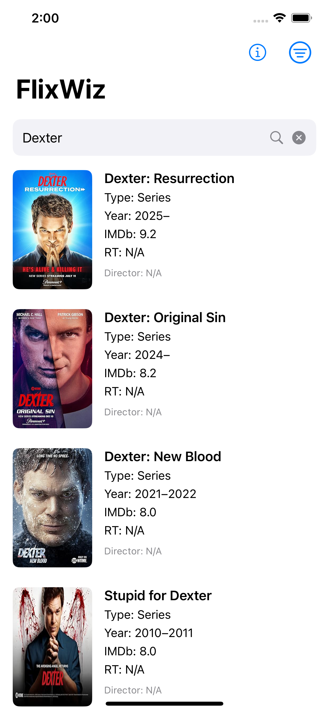

# FlixWiz 🧙‍♂️🎬

<p align="center">
  
</p>

<p align="center">
  <strong>Your ultimate guide to the world of movies and TV shows.</strong>
</p>

<p align="center">
  
  
  
</p>

---

FlixWiz is a sleek and intuitive iOS application designed to help you discover and explore movies and TV shows. Whether you're looking for your next binge-watch, want to check the ratings of a classic film, or find out where to stream a trending new series, FlixWiz has you covered.

## ✨ Features

* **Discover What's New**: Get a glimpse of the trending movies and TV shows from the past week to stay up-to-date with the latest hits.
* **Powerful Search**: Quickly find any movie or TV show with a simple and efficient search.
* **Comprehensive Details**: Get all the information you need in one place, including:
    * IMDb, Rotten Tomatoes, and Metacritic ratings.
    * Plot summaries, cast and crew, genre, runtime, and more.
* **Where to Watch**: Find out where your favorite movies and TV shows are available to stream, rent, or buy.
* **Sleek & Intuitive UI**: Enjoy a clean, modern, and user-friendly interface that makes discovering content a breeze.

## Screentshots

<table>
  <tr>
    <td width="50%" align="center">
      <b>See trending movies on the landing page!</b><br>
      
    </td>
    <td width="50%" align="center">
      <b>See all movies and TV shows matching a keyword search!</b><br>
      
    </td>
  </tr>
  <tr>
    <td width="50%" align="center">
      <b>See detailed movie info by tapping on a search result!</b><br>
      
    </td>
    <td width="50%" align="center">
      <b>Go to movie's Rotten Tomatoes home page for detailed reviews!</b><br>
      
    </td>
  </tr>
  <tr>
    <td width="50%" align="center">
      <b>See where to stream, rent or buy the movie!</b><br>
      
    </td>
    <td width="50%" align="center">
      <b>See reverse chronological list of all matching results!</b><br>
      
    </td>
  </tr>

</table>

## 🚀 Tech Stack

FlixWiz is built with the latest Apple technologies and leverages some of the best entertainment data APIs available:

* **SwiftUI**: The entire user interface is built declaratively with SwiftUI, ensuring a modern and responsive design.
* **APIs**:
    * **The Movie Database (TMDB)**: For trending movies and TV shows, as well as detailed information and images.
    * **OMDb API**: For comprehensive movie and TV show data, including ratings from various sources.
    * **Watchmode**: To provide up-to-date information on where to watch content across various streaming services.

## 🛠️ Getting Started

To get the FlixWiz project up and running on your local machine, follow these simple steps:

1.  **Clone the repository:**
    ```bash
    git clone https://github.com/vibecoderx/FlixWiz.git
    cd FlixWiz/ios
    ```
2.  **Open the project in Xcode:**
    ```bash
    open FlixWiz.xcodeproj
    ```
3.  **Set up your API Keys:**
    FlixWiz requires API keys from TMDB, OMDb, and Watchmode to function correctly. These are managed using an `Secrets.xcconfig` file.
    * In the `FlixWiz/ios` directory, create a new file named `Secrets.xcconfig`.
    * Add your API keys to this file in the following format:

        ```
        TMDB_API_KEY = YOUR_TMDB_API_KEY
        OMDB_API_KEY = YOUR_OMDB_API_KEY
        WATCHMODE_API_KEY = YOUR_WATCHMODE_API_KEY
        ```

4.  **Build and Run:**
    Select your target device or simulator in Xcode and press `Cmd+R` to build and run the application.

## 📄 License

This project is licensed under the MIT License. See the [LICENSE](LICENSE) file for more details.

## 🙏 Acknowledgments

A huge thank you to the following APIs for providing the data that powers FlixWiz:

* [The Movie Database (TMDB)](https://www.themoviedb.org/)
* [OMDb API](https://www.omdbapi.com/)
* [Watchmode](https://www.watchmode.com/)

---


> ### **A Note on How This App Was Built**
>     
> A significant portion of the code in this repository was generated with the assistance of a large language model (LLM). This project was largely **"vibe-coded,"** meaning it was developed through a rapid, iterative, and conversational process with a GenAI tool with minimal review of the generated code. Correctness of the code was checked at certain core places (e.g., using the correct API endpoints, etc). Overall app correctness check was done via manual testing of various UI workflows.

---

